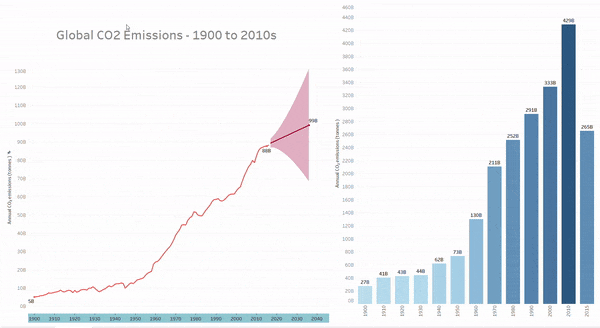

# Description
A Tableau Dashboard data visualisation depicting global CO2 emission rates over decades, from 1900 - 2015. The charts include a line chart that forecasts CO2 emission rates for each decade past 2015 up to 2040. The other chart shows a simple bar chart of the CO2 emission rates at the start of each decade from 1900 - 2010 and also showing the emission rate for 2015. The dataset is here: https://www.kaggle.com/yoannboyere/co2-ghg-emissionsdata.

The link to the Dashboard on Tableau Public is here: https://public.tableau.com/views/GlobalCO2Emissions_16279922715200/Dashboard1?:language=en-GB&:display_count=n&:origin=viz_share_link.

# Demo

